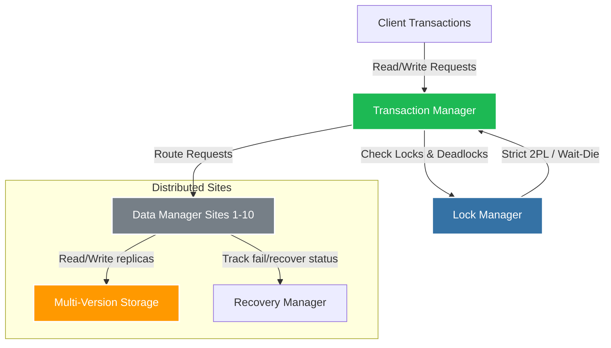

* RepCRec – Replicated Concurrency Control and Recovery.
* Implemented a distributed database, complete with multi-version concurrency control (MVCC), deadlock detection, replication, and failure recovery. 
* Algorithms used: Available copies approach using strict two phase locking (2PL).

### Replicated MVCC Transaction Architecture

  
More on this project can be found <a href="https://github.com/Aman-Chopra/RepCRec" target="_blank">here</a>